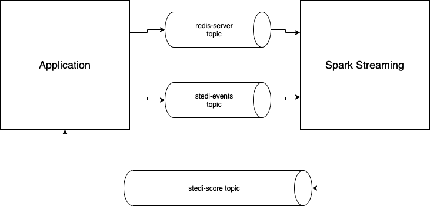

# Project: Evaluate Human Balance

This project works with a real-life application called the Step Trending Electronic Data Interface (STEDI) used to assess fall risk for seniors. When a senior takes a test, they are scored using an index which reflects the likelihood of falling, and potentially sustaining an injury in the course of walking.

## The Data
The STEDI data science team has configured some real-time data sources using Kafka Connect. One of those data sources is **Redis** for risk score and other data. Redis is configured as a Kafka source and whenever any data is saved to Redis (including Customer information), a payload is published to the Kafka topic called redis-server.

The STEDI application development team has programmed certain business events to be published automatically to **Kafka**. Whenever a customer takes an assessment, their risk score is generated, as long as they have four or more completed assessments. The risk score is transmitted to a Kafka topic called stedi-events 

## The Challenge
The application development team was not able to complete the feature as the graph is currently not receiving any data. Because the graph is currently not receiving any data, you need to generate a new payload in a Kafka topic and make it available to the STEDI application to consume. All these processes will be conducted via **Spark Streaming** API.


## Project Architecture




## Project Structure

```
Evaluate Human Balance
|____Guide.ipynb
|____sparkpyrediskafkastreamtoconsole.py    # Spark streaming script - TODO
|____sparkpyeventskafkastreamtoconsole.py   # Spark streaming script - TODO
|____sparkpykafkajoin.py                    # Spark streaming script - TODO
|____submit-redis-kafka-streaming.sh
|____submit-event-kafkastreaming.sh
|____submit-event-kafkajoin.sh
|
|____stedi-application
| |____application.conf                     # Config file for Kafka topic
| |____stop.sh
| |____start.sh
|
|____Spark
| |____logs                                 # Result logs - WORKSPACE BUTTON EXECUTION
| | |____redisstream.log
| | |____eventstream.log
| | |____kafkajoin.log
| | |____spark--org.apache.spark.deploy.master.Master-1-53eda89c49aa.out
| | |____spark--org.apache.spark.deploy.worker.Worker-1-53eda89c49aa.out
|
|____screenshots                            # Stedi Graph screenshots
| |____screenshot 2.jpg
| |____screenshot 1.jpg
```

## Application Startup
### Step 1 - Application Startup
To startup the STEDI Application, make use of the "Startup" button on Page 1 of Guide. This starts the Kafka Application including zookeper. After Login into the Stedis application (credentials are being provided at the log in screen) the toggle for creating test data (which can be found in the top right corner). 

### Step 2 - Start Spark
To start spark follow these steps. Go to ```/data/spark/sbin``` which is the location of several shell scripts. Execute the shell scripts in the following order:
master: ```./start-master.sh```
cat log path: ```cat [LOG PATH]```
slave: ```./start-slave.sh [SPARK URI]```
After successful startup, log the results in the log folder using the "Save Spark Startup Logs" as required for submission. 

### Step 3 - Kafka Topic
edit the ```/home/workspace/stedi-application/application.conf``` config file the kafka topic name of your choice.

### Step 3 - STEDI start
Make use of the "Start STEDI Application" button following the login into the application. When navigating to the Graph, the application returns an empty frame.

### Step 4 - Finalize scripts
Finalize the following scripts "sparkpyrediskafkastreamtoconsole.py", "sparkpyeventskafkastreamtoconsole.py" and "sparkpykafkajoin.py". Test run the using these shell scripts:
sparkpyrediskafkastreamtoconsole.py >>> ```/home/workspace/submit-redis-kafka-streaming.sh```
sparkpyeventskafkastreamtoconsole.py >>> ```/home/workspace/submit-event-kafkastreaming.sh```
sparkpykafkajoin.py >>> ```/home/workspace/submit-event-kafkajoin.sh```

### Step 5 - Check Results
After a few minutes the results of the spark stream should be showing up in the application graph.